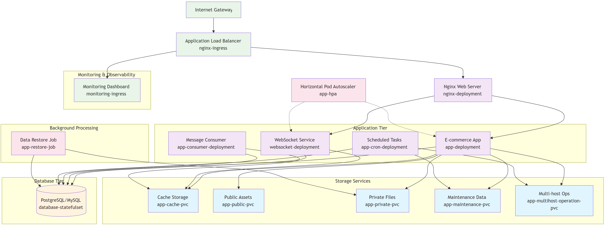

# ESGI M2IW - Projet de Kubernetes

## Présentation du sujet

Le but de ce projet est de migrer une application e-commerce open source 'OroCommerce' d'un docker-compose vers un cluster Kubernetes tout en prenant en compte les bonnes pratiques de déploiement et d'architecture cloud native.

## Présentaion du projet



Namespaces :

- `orocommerce` : Application principale
- `monitoring` : Prometheus, Grafana

Composants :

- OroCommerce (PHP-FPM + Nginx)
- PostgreSQL (StatefulSet)
- WebSocket, Consumer, Cron (pods dédiés)
- Monitoring (Prometheus, Grafana, etc.)
- Ingress HTTP/S

## Démarrer le projet

Une fois le répos cloné, placez vous dans le dossier `helm_chart` et exécutez les commandes suivantes :

### Etape 1: Mettre en place le Ingress Nginx

```bash
kubectl config use-context docker-desktop

kubectl apply -f https://raw.githubusercontent.com/kubernetes/ingress-nginx/controller-v1.8.2/deploy/static/provider/cloud/deploy.yaml

kubectl wait --namespace ingress-nginx \
  --for=condition=ready pod \
  --selector=app.kubernetes.io/component=controller \
  --timeout=90s
```

### Etape 2: Deployer OroCommerce

```bash
helm install -n orocommerce --create-namespace orocommerce .
```

### Etape 3: Monitoring avec Prometheus et Grafana

```bash
helm repo add grafana https://grafana.github.io/helm-charts
helm repo add prometheus-community https://prometheus-community.github.io/helm-charts
helm repo update
helm install grafana grafana/grafana --namespace monitoring --create-namespace
helm install prometheus prometheus-community/prometheus --namespace monitoring
kubectl apply -f helm_chart/monitoring-ingress.yaml

```

### Etage 4: Configuration des hôtes

```bash
echo "127.0.0.1 orocommerce.local" | sudo tee -a /etc/hosts
echo "127.0.0.1 graphana.local" | sudo tee -a /etc/hosts
echo "127.0.0.1 prometheus.local" | sudo tee -a /etc/hosts
```

## Accéder à l'application

Pour accéder à l'application il faut passer par les liens suivant:

- [OroCommerce](http://orocommerce.local)
- [Grafana](http://grafana.local)
- [Prometheus](http://prometheus.local)

## Documentation

La migration vers Kubernetes offre des bénéfices clés :

1. **Orchestration**

- **Auto-healing** et **scaling** intégrés
- **Rolling updates** avec rollback

2. **Résilience**

- **Répartition de charge** automatique
- **Meilleure gestion des pannes**

3. **Stateful workloads**

- **StatefulSets** pour bases de données
- **Volumes persistants** natifs

4. **Réseau**

- **Ingress unifié** pour l'exposition des services
- **Load Balancer** intégré (vs port binding manuel)

5. **Monitoring**

- **Métriques système et applicatives** natives
- **Intégration facile** avec Prometheus/Grafana

## Membres du Groupe 6

- CARCIU Mateo
- KAFADAR Cihan
- NGGILI PAUL
- ZAHAF-KRADRA Ilyas
